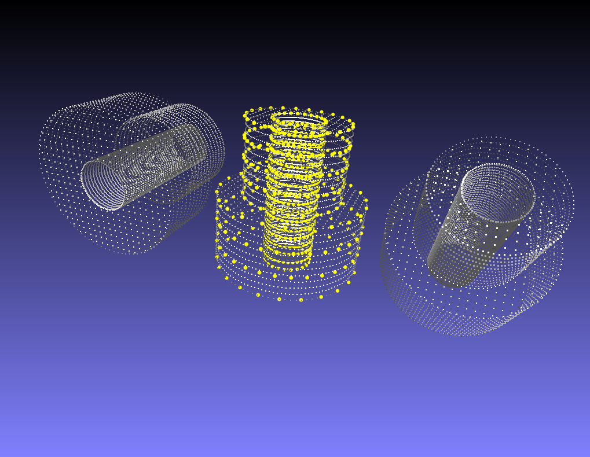

# ICP
Testing example of OpenCV::ICP

## Build
1. cmake .
2. make

## Run
./icp

## To choose input data(PLY)
Set the file names(.ply) in line 11~12  
Data should be PLY format
~~~
	Mat model=loadPLYSimple("model-low.ply",0);
	Mat scene=loadPLYSimple("scene-high.ply",0);

~~~

## Result example
Result will be shown as a PLY data file "result.ply"  
It can be seen via viewer such as MeshLab (screen shot below)

